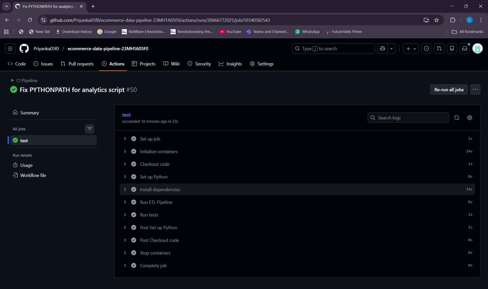
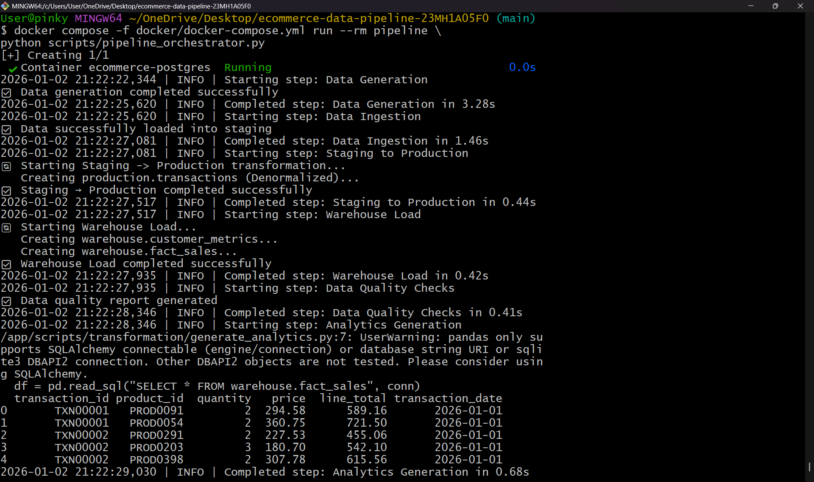
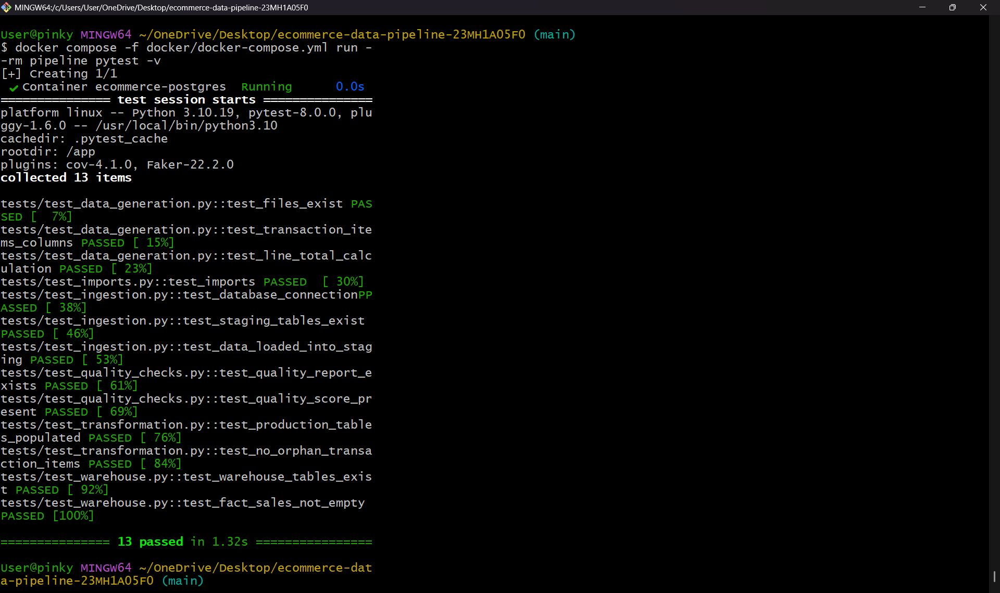
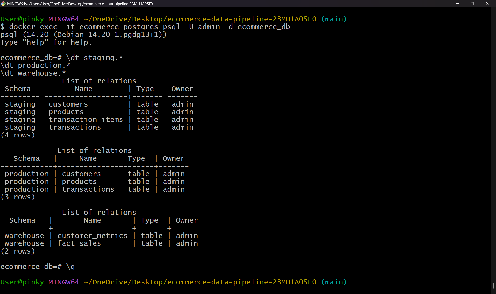

# E-Commerce Data Pipeline – End-to-End ETL Project

## Project Overview
This project implements a complete **end-to-end ETL (Extract, Transform, Load) data pipeline**
for an e-commerce analytics platform.

The pipeline simulates real-world e-commerce data, processes it through multiple database layers,
and prepares it for business intelligence and reporting.

The system is:
- Fully automated
- Containerized using Docker
- Validated using automated testing (Pytest)
- Designed using industry-standard data modeling practices

---

## ✅ Project Verification

### CI Pipeline (GitHub Actions)


### Docker ETL Pipeline Execution


### Automated Tests (Pytest)


### Database Schemas


---
## Project Architecture

The pipeline follows a **layered architecture** to ensure:
- Data quality
- Scalability
- Maintainability
- High analytical performance

Each layer has a clear responsibility and data flows sequentially through the system.

### Data Flow
```
┌────────────────────┐
│  Data Generation   │
│  (Python + Faker)  │
└─────────┬──────────┘
          ↓
┌────────────────────┐
│  Staging Schema    │
│  (Raw CSV Load)    │
└─────────┬──────────┘
          ↓
┌────────────────────┐
│ Production Schema  │
│ (Cleaned, 3NF)     │
└─────────┬──────────┘
          ↓
┌────────────────────┐
│ Warehouse Schema   │
│ (Star Schema)      │
└─────────┬──────────┘
          ↓
┌────────────────────┐
│ Analytics Tables   │
│ (Aggregates)       │
└─────────┬──────────┘
          ↓
┌────────────────────┐
│ BI Dashboards      │
│ Power BI / Tableau │
└────────────────────┘

```

---

## Technology Stack

| Layer | Technology |
|-----|-----------|
| Data Generation | Python (Faker) |
| Database | PostgreSQL 14 |
| ETL Processing | Python (Pandas, psycopg2) |
| Orchestration | Python Pipeline Orchestrator |
| Data Validation | Custom Quality Checks |
| Containerization | Docker, Docker Compose |
| Testing | Pytest |
| BI Tools | Power BI Desktop / Tableau Public |

---

## Project Structure
```
ecommerce-data-pipeline/
│
├── data/
│ ├── raw/ # Generated CSV files
│ ├── processed/ # Reports and analytics outputs
│
├── scripts/
│ ├── data_generation/ # Synthetic data creation
│ ├── ingestion/ # Load CSV → staging
│ ├── quality_checks/ # Data validation rules
│ ├── transformation/ # Staging → production → warehouse
│ ├── monitoring/ # Pipeline health monitoring
│ ├── pipeline_orchestrator.py
│ ├── scheduler.py
│
├── sql/
│ ├── ddl/ # Database schema definitions
│
├── tests/ # Automated tests (pytest)
│
├── docs/
│ ├── architecture.md
│ ├── dashboard_guide.md
│
├── docker/
│ ├── Dockerfile
│ ├── docker-compose.yml
│
├── logs/
├── README.md
└── pytest.ini
```


---

## Setup Instructions

### Prerequisites
- Docker Desktop
- Git
- Python 3.10+ (optional for local execution)

### Setup Steps
```bash
git clone https://github.com/Priyanka05f0/ecommerce-data-pipeline-23MH1A05F0
cd ecommerce-data-pipeline-23MH1A05F0
docker compose -f docker/docker-compose.yml up --build -d
```
This will:

- Start PostgreSQL
- Build the pipeline container
- Prepare the environment for execution

---

# Running the Pipeline
## Full Pipeline Execution
Runs all steps in sequence using the orchestrator.
```bash
docker-compose -f docker/docker-compose.yml run --rm pipeline \
python scripts/pipeline_orchestrator.py
```
### Run Individual Steps
```bash
python scripts/data_generation/generate_data.py
python scripts/ingestion/ingest_to_staging.py
python scripts/quality_checks/validate_data.py
python scripts/transformation/staging_to_production.py
python scripts/transformation/load_warehouse.py
python scripts/transformation/generate_analytics.py
```
Each step can be run independently for debugging or validation.

---

# Running Tests

Automated tests validate:
- Data correctness
- Schema integrity
- Referential integrity
- Successful data loading

```bash
docker compose -f docker/docker-compose.yml run --rm pipeline pytest -v
```
---

# Dashboard Access

1. Power BI File: dashboards/powerbi/ecommerce_analytics.pbix

---

# Database Schemas
## Staging Schema

Raw data loaded directly from CSV files.

- staging.customers
- staging.products
- staging.transactions
- staging.transaction_items

## Production Schema

Cleaned and validated data using normalized design.
- production.customers
- production.products
- production.transactions
- production.transaction_items

## Warehouse Schema

- Star schema optimized for analytics.
- warehouse.dim_customers
- warehouse.dim_products
- warehouse.dim_date
- warehouse.dim_payment_method
- warehouse.fact_sales
- warehouse.agg_daily_sales
- warehouse.agg_product_performance
- warehouse.agg_customer_metrics

---

# Key Insights from Analytics

-Identification of top-performing product categories
- Monthly revenue trends
- Customer segmentation insights
- Geographic sales distribution
- Payment method preferences

# Challenges & Solutions

- Data consistency issues: Solved using validation rules
- Schema integrity: Enforced via foreign keys
- Performance: Optimized using star schema and aggregations

# Future Enhancements

- Real-time streaming with Kafka
- Cloud deployment (AWS/GCP/Azure)
- Advanced ML-based predictions
- Real-time alerting and monitoring

---

# Contact

- Name: Lakshmi Priyanka Bethampudi
- Roll Number : 23MH1A05F0
- Email : 23mh1a05f0@acoe.edu.in
